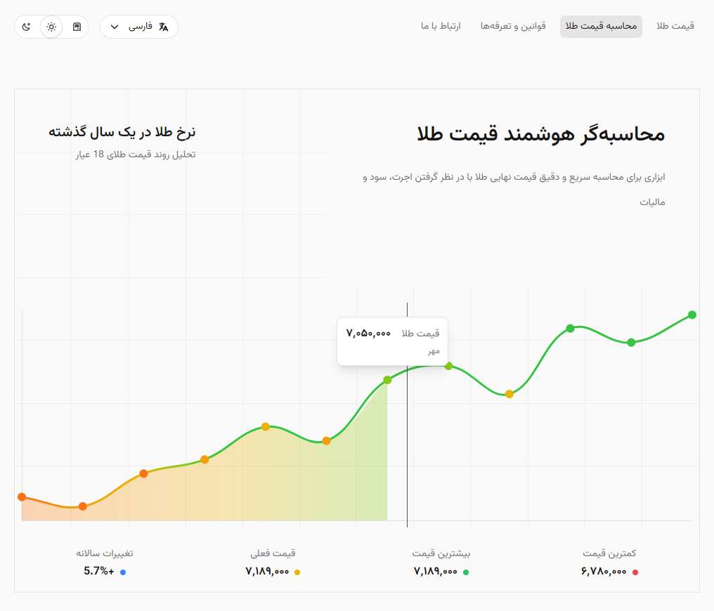
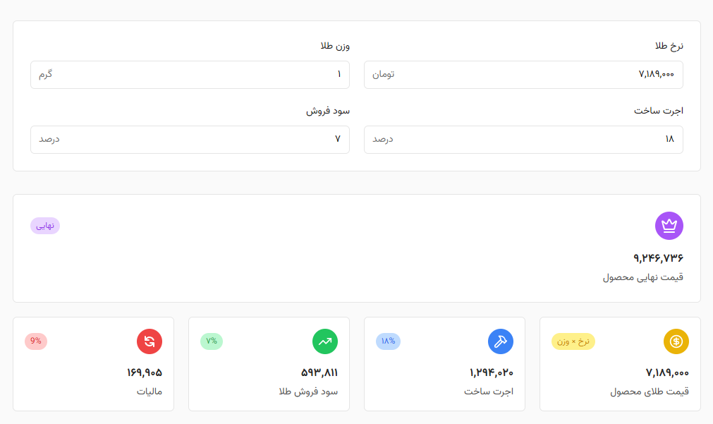

# GoldcalCulator

A responsive web application for calculating the final price of gold jewelry, taking into account the current gold rate, weight, workmanship fees, sales profit, and tax. The app also displays an interactive chart of the 18-carat gold price trend over the past year, with support for dark mode and right-to-left (RTL) layouts.

## Features

- Real-time line chart of 18-carat gold prices for the last year (powered by Chart.js)
- Smart calculator for:
  - Product gold price (rate × weight)
  - Workmanship fee (percentage of gold price)
  - Sales profit (percentage of (gold price + workmanship))
  - Tax (percentage of (gold price + workmanship + profit))
  - Final price breakdown
- Dark mode and light mode theme switching
- Language selector (Persian / English)
- Responsive design optimized for mobile and desktop
- RTL layout for Persian language

## Screenshots

> **Note:** Replace the placeholder paths with your actual screenshot images.

| Home & Chart View                                              | Calculator View                                                  |
| -------------------------------------------------------------- | --------------------------------------------------------------- |
|             |     |

## Installation

1. Clone the repository:

   ```bash
   git clone https://github.com/Siamak-Khalili/GoldCalculator.git
   cd GoldcalCulator
   ```

2. Install dependencies:

   ```bash
   npm install
   ```

3. Build Tailwind CSS in watch mode:

   ```bash
   npm run dev
   ```

4. Open `public/index.html` in your web browser:

   ```bash
   open public/index.html   # macOS
   start public/index.html  # Windows
   ```

## Usage

1. On page load, the gold price chart for the past year will be displayed.
2. Navigate to **محاسبه قیمت طلا** (Calculate Gold Price) in the menu.
3. Enter the following inputs:
   - Current gold rate (تومان)
   - Weight of the gold (grams)
   - Workmanship fee (% of gold price)
   - Sales profit (% of (gold price + workmanship))
4. View the breakdown of:
   - Product gold price
   - Workmanship amount
   - Profit amount
   - Tax amount
   - Final price
5. Toggle between light and dark themes using the theme switcher.
6. Change language between Persian and English using the language selector.

## Technologies Used

- HTML5 & CSS3
- JavaScript (ES6 Modules)
- [Tailwind CSS](https://tailwindcss.com/) for utility-first styling
- [Chart.js](https://www.chartjs.org/) for interactive charts
- PostCSS for Tailwind processing

## Folder Structure

```
GoldcalCulator/
├─ assets/                 # Static assets (fonts, images, screenshots)
│  └─ fonts/               # Custom font files
├─ public/                 # Compiled build output and entry HTML
│  ├─ build/               # Tailwind CSS output
│  │  └─ tailwind.css
│  └─ index.html           # Main HTML file
├─ src/                    # Source files
│  ├─ css/                 # Tailwind CSS entry
│  │  └─ tailwind.css
│  └─ js/                  # JavaScript modules
│     ├─ app.js            # Entry point, initializes managers
│     ├─ calculate.js      # Gold price calculation logic
│     ├─ chart.js          # Chart.js initialization and configuration
│     ├─ dropdown.js       # Custom dropdown menu logic
│     ├─ lang.js           # Language manager for Persian/English
│     ├─ menu.js           # Navigation menu toggling logic
│     └─ theme.js          # Theme switching logic
├─ node_modules/           # Project dependencies
├─ package.json            # Project manifest
├─ package-lock.json       # Exact dependency versions
├─ tailwind.config.js      # Tailwind CSS configuration
└─ postcss.config.js       # PostCSS configuration
```

## Author

**Siamak-Khalili**

- GitHub: [Siamak-Khalili](https://github.com/Siamak-Khalili)
- Email: siamak.khalili77@gmail.com

## License

This project is licensed under the MIT License. See the [LICENSE](LICENSE) file for details.
